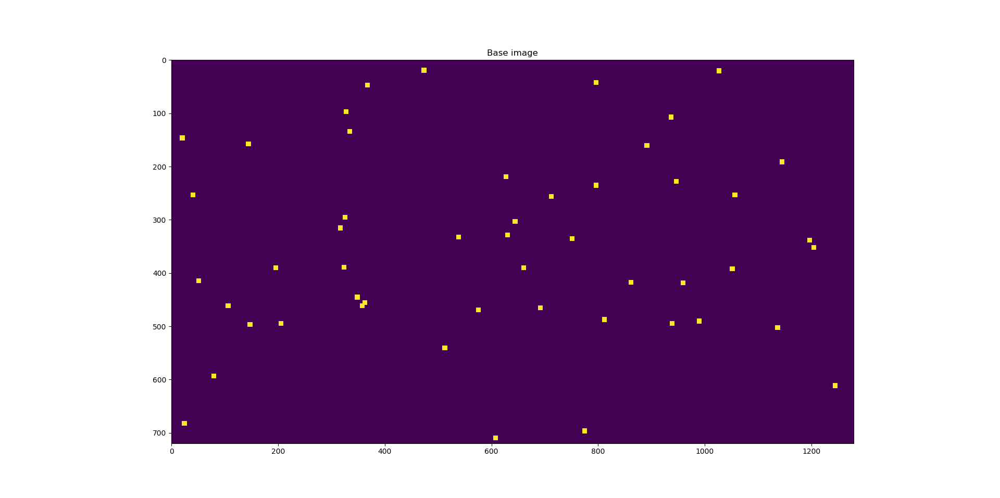
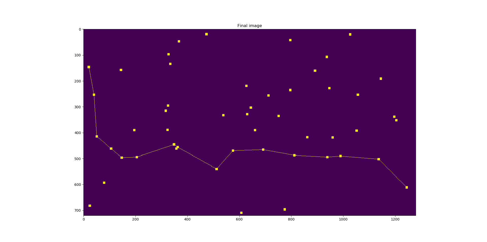

# Network Shortest Path

This small project was done as an example of an implementation of [Dijkstra's shortest path algorithm (1959)](http://www.cs.yale.edu/homes/lans/readings/routing/dijkstra-routing-1959.pdf).

The idea behind it is to simulate a network in which the goal is to connect two nodes consuming the minimum possible energy, which is function of the square of the distance.

## Algorithm

The network is randomly generated as an binary array, with nodes represented by squares of an certain odd size (which can be changed in the code). The center of the node is its actual position. An example of the resulting image is:

With that image (which is actually considered as data for the problem), the first task is to get the nodes. In order to do so, a blur filter is processed. A blur filter is a lowpass filter: for a filter gain of 1, the sum of the coefficients should be 1. After applying this filter, the central node is the pixel with the highest value compared to its immediate pixels. Also, a threshold value is set up in order to avoid local minima.

After that, the energy consumption is calculated, using as distance the Euclidean distance (energy ~ distance²).

Then, Dijkstra's shortest path algorithm is used to compute the shortest path between two nodes. The initial node (source) will be the most left one, and the final node (destination) will be the most right one (this is given to the algorithm as inputs).

Finally, the path is drawn in the image using [Bresenham's line algorithm (1965)](https://gitlab.cecs.anu.edu.au/pages/2018-S2/courses/comp1100/assignments/02/Bresenham.pdf) An example of the final result is:

# Data structures

The nodes of the network form a graph in which all the vertex are connected to the rest. It is also a weight graph, being the weights of the edges the energy consumption for the corresponding connection.

Due to this characteristics, this data structure was implemented as a matrix. Its indexes refer to the node and each value represents the weight. Also, it is a symmetric graph, since the energy consumption is the same in both ways; and the diagonal is full of '0's, since there is not transmission in the network between the same node.
